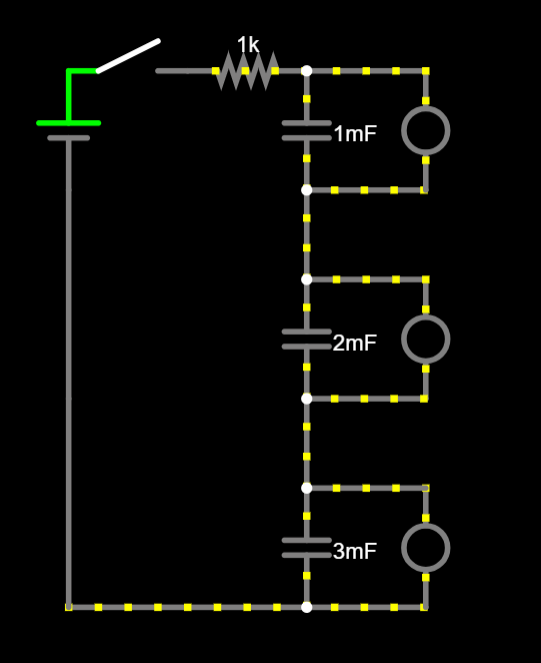
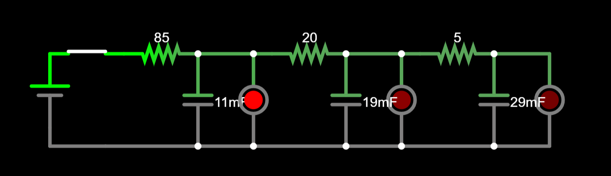
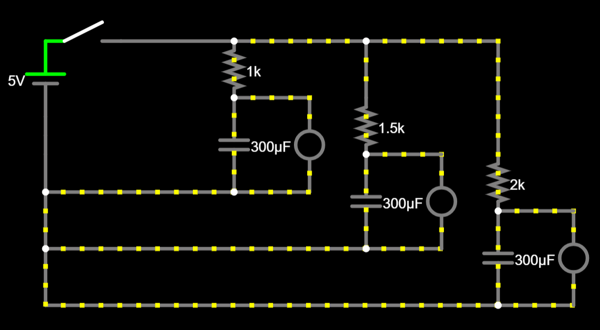

I'm building a circuit that has 3 LEDs turn on 1 by 1 and then turn off all together because I want to learn how to properly use RC circuits.

## 3/10/2026 8:39AM EST - Base Circuit

I worked on making my circuit. I managed to make them all turn one after the other. My goal for this part wasn't to like actually research but just to experiment and see how far I could get. Currently the main issues, it's not self running (depends on a switch for the led to turn on and off) and all the LEDs don't turn off at the same time.

### Time Spent: 1 Hour

## 3/10/2026 11:46 AM EST - Research and Circuit Improvements

Continued to work on the circuit and improved it. It now follows the correct circuit format. They now are turning on 1 after the other a bite better thanks to the resistors. Only issue is that the time between the offs and the ons are still pretty bad. The RC calculator is saying there should be a larger gap but that timing gap isn't actually occuring.

### Time Spent: .9 Hours

## 3/10/2026 2:09 PM EST - Fixes and Finishing

I finally figured out the issue and fixed my project. Instead of having it like my original thing I ended up having 1 long wire with resistors coming out for the led part. Timings have been dropped cause 1 second would end up having a very high resistance of a very high capacitance.

### Time Spent: .4 Hours
